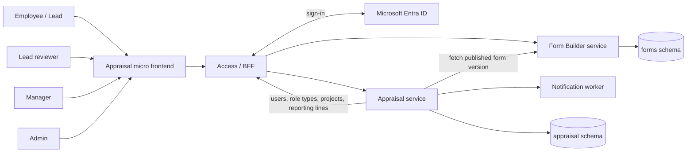
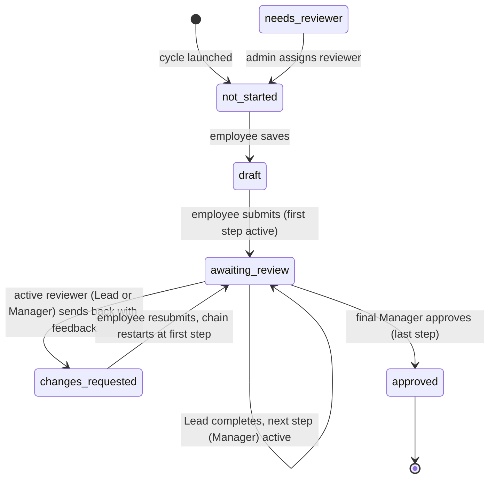

# Appraisal service and Form Builder implementation plan

Prepared 1 October 2026. Status: draft for review with the HPH backend team.

Source: the 1 October 2026 design call with the HPH backend owner, the current `hph-backend`
working copy (commit `ab7ea3b`), the live Supabase schema, and
the shared `HPH_MICROSERVICES_MICROFRONTENDS_ENTRA_IMPLEMENTATION_PLAN.md` (referred to below as
the *platform plan*).

---

# Part 1 — Requirements

## 1. Purpose

HPH needs an appraisal system in which every employee fills an appraisal form for each appraisal
cycle, reviewed along the reporting line used in HPH today: an Employee's appraisal goes
**Employee → Lead → Manager**, and a Lead's own appraisal goes **Lead → Manager**. The manager is
the final approver. The form an employee receives depends on their project and
role, so admins need a way to design and maintain those forms without code changes.

This plan delivers two new microservices that fit the platform plan's architecture:

- **Appraisal service**: cycles, who must fill which form, submissions, and the review/approval
  workflow.
- **Form Builder service** (a sub-service of appraisal): creating, editing, versioning and
  serving form definitions that the frontend renders.

## 2. Scope

**In scope — first draft (v1)**

- Configurable appraisal cycles (quarterly, half-yearly, annual or custom dates) scoped to the
  whole organization or to one project.
- A form builder: create, read, update, delete and publish forms; start from default templates.
- Linking each form to one project and one or more role types.
- Employees filling their assigned form (self-assessment), saving drafts and submitting.
- Reporting-line review in v1: an Employee's appraisal is reviewed by their Lead, who passes it to
  the Manager; a Lead's appraisal goes to their Manager. The manager records the final outcome and
  one-to-one.
- Progress tracking for admins, leads and managers within their permitted scope.
- Supporting both reporting structures used today: employee → lead → manager, and
  employee → manager.
- Microsoft 365 sign-in (Microsoft Entra ID): only HPH employees in the company tenant can sign
  in, with their company account and no HPH password. Required before go-live.

**Out of scope for v1** (designed for, built later after discussion)

- Peer review (optional review requested from colleagues).
- Stakeholder review (a mandatory review by a named senior person when that type is selected).
- Scoring, calibration, salary-hike calculation and KPI-linked goals.
- Employees reporting directly to a Manager (no Lead). The current user rules require every
  employee to report to a lead; this flow can be added later.
- Appraising managers. In v1 only Employees and Leads are appraised; Managers review but are not appraised. Admin, IT admin and Super Admin only monitor the system.

The first draft follows the reporting line: **fill → lead review → manager review → approved** for
Employees, and **fill → manager review → approved** for Leads. Lead review is part of v1, not the later stakeholder-review feature. Peer and additional
stakeholder reviews are added later without changing the required reporting-line sequence.

## 3. Context

### 3.1 Key concepts

| Term | Meaning |
| --- | --- |
| Appraisal cycle | A named period (e.g. "FY2026 Annual", "Q3 2026 Coding") during which forms are filled and reviewed. Created by an admin. |
| Cycle scope | Whether a cycle covers the whole organization or a single project. |
| Role | The user categories an admin picks on the New user screen: **Admin, Manager, Lead, Employee, IT admin** (shown on the 1 Oct call). In the database each role belongs to one fixed *role type* (`super_admin`, `admin`, `manager`, `lead`, `employee`). IT admin is a role under the `admin` role type (confirmed in the live `roles` table, 2026-10-03), not a separate role type. |
| Form | A designed questionnaire: sections and fields (text, rating, choice …). Built in the form builder. |
| Form version | An immutable published snapshot of a form. A cycle always uses a fixed version, so editing a form never changes answers already given. |
| Template | A ready-made default form that admins copy and adjust instead of starting from blank. |
| Form assignment | The rule "this form applies to project X for role types Y, Z". |
| Appraisal | One employee's record in one cycle: their form, answers, reviewer and status. |
| Reviewer | A person assigned a step in the appraisal review chain. For an Employee, their Lead reviews first and their Manager next; for a Lead, their Manager is the only reviewer. The manager is always the final approver. |
| Review type | Lead (required for Employee appraisals, v1), Manager (required final review, v1), Peer (optional, later), Stakeholder (additional named reviewer, mandatory when selected, later). |
| One-to-one | The discussion between employee and reviewer before the reviewer decides. |
| Microsoft 365 sign-in | Signing in with the company Microsoft account (Microsoft Entra ID). Microsoft checks the password and multi-factor authentication; HPH only decides what the signed-in person may see and do. |
| Linked account | An HPH user record that has been matched to exactly one company Microsoft account. Only linked, active users can sign in. |

### 3.2 Context diagram



## 4. Functional requirements

### Cycles

| ID | Requirement | Status |
| --- | --- | --- |
| FR-1 | An admin can create an appraisal cycle with a name, start and end dates, a frequency label (quarterly, half-yearly, annual or custom) and a submission and review deadline. Annual is the default. | Implemented |
| FR-2 | A cycle is scoped either to the whole organization or to one project, so different projects can run their own cycles. | Implemented |
| FR-3 | When an admin launches a cycle, the system creates one appraisal for every active Employee and Lead in scope who has a matching form (Managers and admin-type users are not appraised), and fixes its form version and ordered review chain: Lead then Manager for an Employee, Manager only for a Lead. | Implemented |
| FR-4 | An admin can close a cycle; after closing, no further edits or reviews are allowed. | Implemented |

### Form builder

| ID | Requirement | Status |
| --- | --- | --- |
| FR-5 | An admin can create, view, edit and delete forms made of sections and fields. Supported field types: short text, long text, number, rating scale, single choice, multiple choice, yes/no, date. | Implemented |
| FR-6 | Each field states whether the employee or a reviewer fills it; reviewer sections specify the lead or manager review stage. Required fields, options and limits let the frontend render and validate the correct stage without overwriting another reviewer’s answers. | Implemented |
| FR-7 | A small set of default templates is available; an admin can copy one and adjust it. | Implemented |
| FR-8 | A form is linked to one project and one or more role types (e.g. a "Coding — Employee" form and a separate "Coding — Lead" form). Only one published form may apply to the same project and role type at a time. | Implemented |
| FR-9 | Publishing a form freezes a new version. Editing a published form creates a new draft; cycles already launched keep the version they started with. A form in use by a cycle cannot be deleted, only archived. | Implemented |

### Filling and review

| ID | Requirement | Status |
| --- | --- | --- |
| FR-10 | Employees and leads see the appraisal assigned to them for the open cycle, fill the employee fields, save drafts and submit. Submitting routes it to the first review step: the Lead for an Employee's appraisal, the Manager for a Lead's. | Implemented |
| FR-11 | Review follows the reporting line: an Employee's appraisal goes Employee → Lead → Manager, and a Lead's goes Lead → Manager. The Lead step cannot be skipped for an Employee. The manager is the final approver. | Implemented |
| FR-12 | Each reviewer sees appraisals awaiting their current step, reads the employee’s answers and prior review, and fills their own stage’s fields. A Lead either completes their review, which forwards it to the Manager, or sends it back to the employee with written feedback if changes are needed. Only the assigned manager can record final approval, after the required one-to-one. | Implemented |
| FR-13 | At the manager step, after the one-to-one, the manager records the final outcome: agreed/approved, or rejected with written feedback passed back to the employee. Either reviewer (Lead or Manager) can send the appraisal back with feedback. What happens after feedback remains undecided (OQ-6); this plan assumes employee revision and resubmission through the required review chain. Lead review completion is a handoff, not final approval. | Implemented |
| FR-14 | After approval the appraisal is read-only for everyone; the employee can view the final answers and reviewer comments. | Implemented |
| FR-15 | Admins, leads and managers see permitted cycle progress per project: not started, in draft, awaiting review (broken down by the current review level, e.g. Lead or Manager), returned and approved. Reviewer inboxes include only their actionable step. | Implemented |
| FR-16 | Employees receive email reminders before deadlines. The first assigned reviewer is notified on employee submission; when a Lead completes review, the Manager is notified of the handoff. | Implemented; emails stay queued until mail delivery is enabled (G-4) |

### Sign-in and access

| ID | Requirement | Status |
| --- | --- | --- |
| FR-19 | Employees sign in to the appraisal screens with their company Microsoft 365 account. HPH no longer asks for or stores its own password. | Implemented behind `ENTRA_SIGN_IN_ENABLED`; needs HPH's app registration to switch on (G-7) |
| FR-20 | Only accounts in the HPH company tenant that are assigned to the application and linked to an existing, active HPH user can sign in. Guests, personal Microsoft accounts and unlinked accounts are refused; no HPH user is created automatically. | Implemented behind `ENTRA_SIGN_IN_ENABLED`; needs HPH's app registration to switch on (G-7) |
| FR-21 | A user's existing HPH identity, role, project and reporting line are kept when they move to Microsoft sign-in, so appraisals, reviewers and history stay attached to the same person. | Implemented behind `ENTRA_SIGN_IN_ENABLED`; needs HPH's app registration to switch on (G-7) |
| FR-22 | When an admin deactivates a user, or their session is revoked or expires, they immediately lose access to appraisals, even if their Microsoft session is still active. | Implemented: the gateway refuses deactivated users, Microsoft sign-in refuses inactive and unlinked accounts |

### Later review types (designed now, built later)

| ID | Requirement | Status |
| --- | --- | --- |
| FR-17 | Peer review: after submitting, an employee may invite colleagues to leave a written comment on their appraisal. Optional, never blocks approval, and not used for salary decisions. | Not implemented (later) |
| FR-18 | Stakeholder review: a cycle or form can require a review from a named senior person (e.g. the lead of another scrum). When this type is selected it is mandatory before the manager can approve. | Not implemented (later) |

## 5. Non-functional requirements

| ID | Requirement |
| --- | --- |
| NFR-1 | Each service owns its own database schema and credentials. No foreign keys or joins across services; other data comes through APIs. |
| NFR-2 | Users only see appraisals they own, review or administer. Every check happens on the server, not only in the UI. |
| NFR-3 | Every status change, review decision and form publish is recorded in an audit log with who and when. |
| NFR-4 | Submitted answers are never altered by later form edits (see FR-9). |
| NFR-5 | Appraisal tables are not reachable through Supabase's public REST API: separate schema, Row Level Security enabled, no `anon` grants. |
| NFR-6 | The new services follow the humango service conventions: a hand-written OpenAPI YAML per service is the source of truth, Connexion 2 maps each `operationId` to a thin handler, business logic lives in `services/`, models in `models/`, Alembic through Flask-Migrate, factory_boy tests, Black and Ruff at 100 columns. The Access/BFF monolith keeps its own flask-smorest conventions. |
| NFR-7 | APIs are described in versioned OpenAPI files so the frontend can generate clients. |
| NFR-8 | No HPH passwords are stored, and Microsoft tokens are kept server-side only. The browser holds only the HttpOnly session cookie. Separate app registrations for development/staging and production. |

## 6. Acceptance criteria

| ID | Criterion |
| --- | --- |
| AC-1 | An admin creates a "Coding — Employee" form from a template, publishes it, creates an annual organization cycle and launches it; every active Coding employee then has an appraisal in "Not started". |
| AC-2 | An Employee's submission appears in their Lead's inbox first and reaches the Manager only after Lead completion; the Manager cannot approve early. A Lead's submission goes directly to their Manager. |
| AC-3 | An employee saves a draft, leaves, returns and submits; it shows as "Awaiting review" with their Lead as current reviewer (a Lead's own appraisal shows their Manager). Lead completion preserves their review and passes the appraisal to the Manager inbox, still "Awaiting review". |
| AC-4 | The Lead or the Manager sends the appraisal back with feedback and the employee sees it; (assuming OQ-6 is answered “revise and resubmit”) the employee edits and resubmits through the required review chain, including Lead review for an Employee. The Manager approves only after preceding steps are complete; nobody can edit it afterwards. |
| AC-5 | Editing and republishing the form during the cycle does not change the questions or answers on existing appraisals. |
| AC-6 | A user who is neither the owner, an assigned reviewer nor an admin receives 403 on another person’s appraisal. Assigned reviewers can write only their current stage’s fields; a Lead cannot finally approve, and a Manager cannot bypass an incomplete Lead step. |
| AC-7 | The progress view shows correct counts per project, with "Awaiting review" broken down by current review level (Lead, Manager); inboxes and handoff notifications reflect the current assigned review step. |
| AC-8 | A linked employee selects "Sign in with Microsoft", completes company sign-in and lands on their appraisal without entering an HPH password. A guest, personal Microsoft account or unlinked company account is refused with a clear message. |
| AC-9 | After an admin deactivates a user, their next appraisal request is refused even though their Microsoft session is still valid. |

## 7. Open questions

| ID | Question | Options / recommendation | Owner | Detail |
| --- | --- | --- | --- | --- |
| OQ-1 (resolved) | Do leads take part in reviewing their team's appraisals? | Confirmed: Employee → Lead → Manager for Employees, Lead → Manager for Leads. Lead review is required in v1; Manager is the final approver. Employees reporting directly to a Manager are out of scope for v1. This changes the manager-only "for now" flow discussed on the 1 Oct call; share with the backend owner before review endpoints are built. | Confirmed 2026-10-03 | §10.2 |
| OQ-2 (resolved) | Who is appraised? | Resolved: v1 appraises Employees and Leads only. Managers review but are not appraised; Admin, IT admin and Super Admin only monitor the system. Manager appraisals can be added later. | Resolved 2026-10-03 | §10.2 |
| OQ-3 | Who may build forms: admins only, or managers for their own project? | Recommend admins only for v1. | Engineering manager | §9.3 |
| OQ-4 (resolved) | Does approval produce a final rating or outcome used for salary hikes? | Resolved: no. The system collects and approves the reviews; it does not score answers or calculate appraisal outcomes. | Resolved 2026-10-03 | §12 |
| OQ-5 | Can one employee belong to more than one project? The current user record holds one project. | Recommend one project per user for v1. | Backend owner | §11 |
| OQ-6 | When the reviewer passes feedback back or rejects, what happens next? The call mentioned "agreed, approved, or feedback passed back" and "rejections", but not what follows. | (a) Employee revises and resubmits (recommended, assumed in this plan); (b) rejection is final and the feedback is only recorded; (c) both, as separate reviewer actions. | Backend owner / engineering manager | §10.3 |
| OQ-7 (resolved) | Who builds Microsoft sign-in, and does appraisal go live only after it is done? | Resolved: built with the appraisal system (`appraisal_system/access_bff/entra`), off by default; going live needs only HPH's app registration from IT (G-7). | Resolved 2026-10-03 | §9.4 |
| OQ-8 (resolved) | Who sees reviewers' answers before the appraisal is approved? | Resolved: the employee sees their own answers and any send-back feedback until approval, then everything; a Lead sees the employee's and their own answers until approval, then everything except the Manager's one-to-one notes; Managers and admins see everything. | Resolved 2026-10-03 | §14 |

---

# Part 2 — Detailed technical requirements

## 8. Current state of the implementation

Implemented on branch `nr/appraisal-services` of `hph-backend` (not yet committed). Every
functional requirement in §4 except FR-17 and FR-18 is built and tested; Microsoft sign-in (G-7)
is built and waits only for HPH's app registration.

| Part | Where | What it does |
| --- | --- | --- |
| Form Builder service | `appraisal_system/form_builder/` (`form_builder.yaml`, `handlers/`, `services/`, `models/`, `migrations/`) | Forms, versions, templates, assignments, resolve and answer validation (FR-5 to FR-9) |
| Appraisal service | `appraisal_system/appraisal/` (`appraisal.yaml`, `handlers/`, `services/`, `models/`, `clients/`, `commands.py`, `migrations/`) | Cycles, launch, appraisals, review chain, notifications (FR-1 to FR-4, FR-10 to FR-16) |
| Shared code | `appraisal_system/common/` (`errors.py`, `service_auth.py`, `service_client.py`, `directory_client.py`, `connexion_app.py`, `configdb.py`) | Error format, service tokens, service-to-service HTTP, Connexion wiring; no models or domain logic (NFR-1) |
| Directory API (Access) | `appraisal_system/access_bff/directory/` | Read-only users and projects for the services, service-token only (closes G-3) |
| Gateway (BFF) | `appraisal_system/access_bff/gateway/`, `appraisal_system/access_bff/service_auth.py` | `/api/appraisal/*` and `/api/form-builder/*` forwarded with a signed user token (§9.4) |
| Feature seeds | `migrations/versions/f057fd6ddc83_seed_appraisal_features.py` | The four appraisal features and their default grants (§9.3) |
| Microsoft sign-in | `appraisal_system/access_bff/entra/`, migration `f1699bb5cd1a_add_microsoft_sign_in_identities.py` | FR-19 to FR-22, off until `ENTRA_SIGN_IN_ENABLED` (§9.4) |
| Developer guide | `appraisal_system/README.md`, `appraisal_system/docs/MICROSOFT_SIGN_IN.md` | Running, testing, configuring and deploying; sign-in set-up and the request for IT |

Existing monolith pieces the services build on:

| Area | Where | Use for appraisal |
| --- | --- | --- |
| Users | `app/users/models.py` `User` (`emp_id`, `role_id`, `project_id`, `reports_to_id`, `is_active`, `last_working_day`) | Participants, reporting line, leavers (read through the directory API) |
| Projects | `app/users/models.py` `Project` | Form assignment and cycle scope |
| Role types | `migrations/versions/45cebe4736e4_seed_role_types.py`: `super_admin`, `admin`, `manager`, `lead`, `employee` | Reviewer resolution (lead/manager steps) |
| Roles | `app/roles/models.py` `Role` (`title`, `role_type_id`); the New user screen lists roles, including the live-data role IT admin (G-8) | Display |
| Feature permissions | `app/features/models.py` `Feature`, `role_features` (`can_read`, `can_write`) | Copied into the gateway's user token (§9.3) |
| Reporting-line rules | `app/users/schemas.py` `REPORTING_PARENT_ROLE_TYPES` (`employee` → `lead`, `lead` → `manager`) | Matches the two v1 review chains, so no user-rule change was needed |
| Sessions | `app/sessions/` (password login, HttpOnly cookie) | The gateway relies on it; Microsoft sign-in replaces the password step (G-7) |

## 9. Architecture

### 9.1 Services and ownership

| Service | Owns | Calls | Called by |
| --- | --- | --- | --- |
| `form-builder` | Forms, form versions, templates, form assignments (project + role types) | Access (project/role-type lookups for validation) | BFF (admin UI), Appraisal |
| `appraisal` | Cycles, appraisals, answers, review decisions, comments, audit log | Form Builder (resolve and fetch versions), Access (users, reporting lines), notification worker | BFF |
| Access / BFF (existing monolith for now) | Users, role types, projects, reporting lines, Microsoft Entra sign-in and authenticated sessions | Microsoft Entra | Everyone |

Why a separate form builder: forms are generic (sections, fields, versions) and can be reused for
other HPH workflows later (onboarding, surveys). It keeps appraisal logic free of form-rendering
concerns. Why answers live in appraisal and not in form builder: approval status and answers must
change in one transaction; splitting them across services would need distributed consistency for
no v1 benefit.

### 9.2 Repository layout

Everything for the appraisal system lives in one directory, `appraisal_system/`, with one
self-contained directory per microservice and the shared library beside them:

```text
hph-backend/
  app/                     existing Flask app (Access/BFF); its only change is init_access_bff(app, api)
  migrations/versions/     + two migrations: appraisal feature seeds, Microsoft identity tables
  appraisal_system/
    README.md  docs/  ruff.toml  conftest.py
    common/                shared library, symlinked into each service as service/common
    form_builder/          form_builder.yaml, main.py, config*.py, handlers/, services/, models/,
                           clients/, migrations/ (schema forms), tests/, Dockerfile, gunicorn.conf.py
    appraisal/             same shape (schema appraisal), plus commands.py for scheduled jobs
    access_bff/            plugin for the Flask app: directory/, gateway/, entra/, service_auth.py,
                           settings.py, tests/ (run with the Flask app's test suite)
```

Shared code is limited to auth, HTTP client, error and logging helpers. No shared SQLAlchemy
models.

### 9.3 Authorization

Microsoft Entra sign-in is required in v1 and is integrated through Access / BFF as specified
by the platform plan. Access / BFF validates the sign-in and maps the authenticated identity to
an active HPH user record. Appraisal and Form Builder use that trusted user context for the
existing role, feature and object-level checks; Entra authentication does not replace them.
The first-draft pilot must not defer Entra sign-in or rely solely on the existing login flow.

Feature codenames are seeded by `f057fd6ddc83_seed_appraisal_features.py` and granted to the starter roles through `role_features`; roles created later in the UI (e.g. IT admin) get them through the Roles screen if needed:

| Feature | Default grant | Allows |
| --- | --- | --- |
| `form_builder` | Super Admin, Admin (read, write) | Create, edit, publish, archive and assign forms; list templates |
| `appraisal_cycle_admin` | Super Admin, Admin (read, write) | Create, launch, close cycles; reassign reviewers; view every appraisal and all progress |
| `appraisal_review` | Lead, Manager (read, write) | Review assigned appraisals; Lead completes their step and forwards or sends back; Manager sends back or finally approves after required prior steps |
| `appraisal_self` | Employee, Lead (read, write) | Fill and submit own appraisal |

Object-level checks always apply on top: an employee acts only on their own appraisal; reviewers
can read only appraisals with an assigned review step (unless separately authorized as admin).
Reviewer writes require `current_reviewer_user_id` to match the caller and must target that step’s
fields. Only the final assigned Manager may approve, and only after the required Lead step is
complete. No role grant alone allows skipping a step or approving someone else’s appraisal.

### 9.4 Authentication with Microsoft Entra ID (FR-19 to FR-22)

Follows the platform plan §4 (sign-in implementation) and its work items AUTH-01 to AUTH-05;
appraisal adds no separate sign-in.

- **Sign-in happens only at the Access/BFF (built).** `appraisal_system/access_bff/entra` uses
  MSAL for the authorization code flow with PKCE against HPH's tenant only (the tenant ID is in
  the authority, never `common`). The sign-in record (state, nonce, PKCE verifier) stays on the
  server for at most 10 minutes; the ID token's issuer, audience, nonce, tenant and expiry are
  checked; `(tid, oid)` is looked up in `external_identities`; the user gets the existing
  HttpOnly session cookie. No Microsoft token is stored. Off until `ENTRA_SIGN_IN_ENABLED`.
- **Linking (decided while building).** A first-time Microsoft account is linked to the active
  HPH user with the same company email; Admin and Super Admin accounts and any second account for
  the same person are linked only by an administrator (`flask entra-link`). Guest accounts and
  other tenants are refused. `PASSWORD_LOGIN_ENABLED=false` switches password sign-in off once
  everyone has moved. Set-up, rollout and the request for IT: `appraisal_system/docs/MICROSOFT_SIGN_IN.md`.
- **The appraisal UI never handles Microsoft tokens.** No MSAL in the micro frontend; it calls the
  BFF with the session cookie, and the shell's current-user endpoint supplies the user snapshot.
- **Service-to-service (as built).** The gateway (`appraisal_system/access_bff/gateway/routes.py`) signs a 60-second
  Ed25519 token for every forwarded request, carrying the HPH user id, role type, project and
  feature grants, addressed to one service. Services hold only the BFF's public key, so they can
  verify but never mint user tokens; each service also signs its own *service* tokens for calls
  to other services (`appraisal_system/common/service_auth.py`). A request without a valid token from a trusted
  issuer is rejected, so nothing reaches a service except through the BFF. Deviation from
  platform plan §4.4 (Entra delegated tokens per service): the services never see Microsoft
  tokens at all, so switching the BFF's login to Microsoft needs no change in them.
- **Revocation.** The BFF checks the session and `users.is_active` on every request before
  forwarding (FR-22).
- **Until sign-in is switched on.** The gateway accepts the current password-based session;
  nothing in the services changes when Microsoft sign-in replaces it.

Built: `external_identities` and `entra_login_transactions` tables, routes
`/auth/microsoft/login` and `/auth/microsoft/callback`, the `entra-link` / `entra-unlink`
commands and the password switch. Not changed: `users.password_hash` stays required (it only
needs to become nullable when Microsoft-only accounts are created), logout is the existing HPH
logout (no Microsoft sign-out), and password screens stay until the frontend hides them.

### 9.5 Database placement

Supabase Postgres, two new schemas `forms` and `appraisal`, each with its own login role that has
rights only on its own schema. RLS enabled and no grants to `anon`/`authenticated` (NFR-5). User,
project and role-type IDs are stored as plain integers (no cross-schema foreign keys, NFR-1).
Each service's Alembic version table lives in its own schema and its migrations only touch that
schema, so the monolith's `public` migrations and the services' never interfere. The SQL for the
per-service roles, grants and RLS is in `appraisal_system/README.md` (run by a database admin).

## 10. Detailed requirements

### 10.1 Form definition schema (FR-5, FR-6)

A form version stores its structure as JSON (snake_case, like the rest of the services' APIs),
validated on publish by `appraisal_system/form_builder/services/definition.py`:

```json
{
  "sections": [
    {
      "key": "self_assessment",
      "title": "Self-assessment",
      "filled_by": "employee",
      "fields": [
        {"key": "key_achievements", "type": "long_text", "label": "Your key achievements",
         "required": true, "max_length": 4000},
        {"key": "self_rating", "type": "rating", "label": "Overall self-rating",
         "required": true, "scale": {"min": 1, "max": 5,
         "labels": {"1": "Needs improvement", "5": "Outstanding"}}}
      ]
    },
    {
      "key": "lead_assessment",
      "title": "Lead review",
      "filled_by": "reviewer",
      "review_stage": "lead",
      "fields": [
        {"key": "lead_comments", "type": "long_text", "label": "Lead comments", "required": true}
      ]
    },
    {
      "key": "manager_assessment",
      "title": "Manager review",
      "filled_by": "reviewer",
      "review_stage": "manager",
      "fields": [
        {"key": "manager_rating", "type": "rating", "label": "Final rating", "required": true,
         "scale": {"min": 1, "max": 5}}
      ]
    }
  ]
}
```

Rules:

- `key` values are lowercase (`^[a-z][a-z0-9_]{0,63}$`), unique within a form (field keys across
  all sections) and stable across versions; answers are stored by key.
- `type` ∈ `short_text | long_text | number | rating | single_choice | multi_choice | yes_no | date`,
  with type-specific properties: `max_length` (text, default 200 / 4000), `min`/`max`/`integer`
  (number), `scale {min, max, labels}` (rating, 0–10), `options [{value, label}]` and
  `min_selected`/`max_selected` (choices), `min`/`max` as `YYYY-MM-DD` (date); every field may
  have `help_text`, `required` and a free-form `ui` object.
- `filled_by` ∈ `employee | reviewer`; reviewer sections declare `review_stage` ∈ `lead | manager`.
  A form needs at least one employee section. Lead sections are unused in a Lead's own appraisal.
- Unknown properties are rejected; every problem is reported at once with its path.
- Answers are validated per stage (`employee`, `lead`, `manager`): only that stage's fields may be
  answered; `draft` mode checks types and limits; `submit` also requires the stage's required
  fields. The Appraisal service calls `POST /form-versions/{version_id}/validate` on every save,
  submit, hand-off and approval.
- Two default templates are seeded: "Employee appraisal (default)" and "Lead appraisal (default)".

### 10.2 Reviewer resolution (FR-11, OQ-1, OQ-2)

OQ-1 is resolved: **an Employee's appraisal is always reviewed by their Lead, then their Manager**.
At cycle launch, for each participant:

1. Resolve the participant’s `reports_to_id` chain from Access, with cycle detection and a maximum
   depth of 5. Verify stored role codes against the confirmed HPH categories (§8).
2. For an Employee (Employee → Lead → Manager), snapshot ordered Lead and Manager review steps. Set
   `lead_user_id` to the Lead and `reviewer_user_id` to the final Manager; employee submission
   activates the Lead step first.
3. For a Lead (Lead → Manager), snapshot a single Manager step and keep `lead_user_id` null.
   An Employee with no Lead (e.g. older records without a reporting line) is `needs_reviewer`;
   Employee → Manager is not supported in v1.
4. Missing/inactive reviewers, a broken or cyclic reporting line, or no Manager produce
   `needs_reviewer`, visible to an admin for correction. Never silently skip a required Lead step.
5. Only Employees and Leads are appraised. Managers, Admin, IT admin and Super Admin are skipped
   at launch.
   Nobody may review or approve their own appraisal.

The Manager receives the appraisal only after required Lead review is completed, with the
employee’s answers and Lead’s review preserved. A Lead's own appraisal goes directly to their Manager.
Reviewer assignments and order are snapshotted at launch. An admin can reassign before
approval, but must preserve the required sequence and audit the change; changed reviewer
steps must be revalidated rather than treated as already completed.

### 10.3 Appraisal status lifecycle (FR-10, FR-12–FR-14)



- `awaiting_review` is one generic status for every review level. Who must act is given by the
  active row in `appraisal_review_steps` (`review_stage`, `reviewer_user_id`), so adding more
  levels later needs no new statuses. The UI shows "Awaiting review — Lead: <name>" or
  "Awaiting review — Manager: <name>"; progress counts group by status and current `review_stage`.
- Any active reviewer (Lead or Manager) may send the appraisal back with written feedback; the
  feedback is stored against that step in `review_comments`.
- Lead completion is a review handoff, never final approval. The Manager cannot act early or
  overwrite Lead answers; each step’s answers, comments and completion time remain auditable.
- The call named the outcomes "agreed, approved, or feedback passed back" and "rejections". The
  `changes_requested → awaiting_review` loop is an assumption pending OQ-6; if rejection is final,
  replace it with a terminal `rejected` state.
- Under the OQ-6 revise/resubmit assumption, employee changes restart the required review chain
  so neither Lead nor Manager review can be bypassed; retain previous review attempts in history.
  This is draft behavior until OQ-6 is decided, not a new decision that rejection is non-final.
- The manager’s one-to-one is recorded as `one_to_one_held_at` (+ optional notes) and is required
  before `approved` (configurable per cycle; default required).
- Closing a cycle locks every appraisal; any not approved keep their status for reporting.
- Every transition writes an `appraisal_events` row.
- As built for the OQ-6 assumption: sending back starts a new round (`review_attempt` + 1) with a
  copy of the employee's answers; reviewers start their sections afresh and the earlier round
  stays readable under `previous_attempts`. A Manager sending back clears the one-to-one.

### 10.4 Data model

As built; generated by Alembic from the models.

**`forms` schema (Form Builder)**

| Table | Columns |
| --- | --- |
| `forms` | `id`, `name`, `description`, `purpose` (`appraisal`), `status` (`draft`/`published`/`archived`), `draft_definition` (jsonb), `created_by`, `updated_by`, `created_at`, `updated_at` |
| `form_versions` | `id`, `form_id`, `version_no`, `definition` (jsonb), `published_by`, `published_at`; unique (`form_id`, `version_no`); the latest version is the one in use |
| `form_assignments` | `id`, `form_id`, `purpose`, `project_id`, `role_type_code`, `active`, `created_by`, `created_at`, `deactivated_at`; partial unique (`project_id`, `role_type_code`, `purpose`) where `active` |
| `form_templates` | `id`, `name` (unique), `description`, `purpose`, `definition` (jsonb), `is_default`, `created_at` |
| `form_events` | `id`, `form_id` (kept as null when a draft is deleted), `actor_user_id`, `action`, `details` (jsonb), `created_at` |

**`appraisal` schema (Appraisal)**

| Table | Columns |
| --- | --- |
| `cycles` | `id`, `name`, `scope`, `project_id`, `frequency`, `start_date`, `end_date`, `submission_due`, `review_due`, `require_one_to_one`, `status`, `launch_summary` (jsonb), `created_by`, `created_at`, `updated_at`, `launched_by`, `launched_at`, `closed_by`, `closed_at`; check constraints on enums, scope/project and date order |
| `appraisals` | `id`, `cycle_id`, `user_id`, `employee_name`, `employee_emp_id`, `project_id`, `role_type_code`, `form_id`, `form_version_id`, `form_name`, `form_definition` (jsonb snapshot), `lead_user_id`, `lead_name`, `manager_user_id`, `manager_name`, `current_reviewer_user_id`, `current_review_step_id`, `review_attempt`, `status`, `needs_reviewer_reason`, `submitted_at`, `approved_at`, `one_to_one_held_at`, `created_at`, `updated_at`; unique (`cycle_id`, `user_id`) |
| `appraisal_answers` | PK (`appraisal_id`, `review_attempt`, `review_stage`, `field_key`), `value` (jsonb), `updated_by`, `updated_at` |
| `appraisal_review_steps` | `id`, `appraisal_id`, `review_attempt`, `sequence_no`, `review_stage` (`lead`/`manager`), `reviewer_user_id`, `reviewer_name`, `status` (`pending`/`active`/`completed`/`returned`/`cancelled`), `activated_at`, `completed_at`, `created_at`; unique (`appraisal_id`, `review_attempt`, `sequence_no`) |
| `review_comments` | `id`, `appraisal_id`, `review_step_id`, `review_attempt`, `review_stage`, `author_user_id`, `author_name`, `kind` (`feedback`/`one_to_one_note`/`comment`), `body`, `created_at` |
| `appraisal_events` | `id`, `cycle_id`, `appraisal_id` (null for cycle events), `actor_user_id`, `action`, `from_status`, `to_status`, `details` (jsonb), `created_at` |
| `notification_outbox` | `id`, `event_type`, `recipient_user_id`, `cycle_id`, `appraisal_id`, `payload` (jsonb), `status` (`pending`/`sent`/`failed`/`skipped`), `attempts`, `last_error`, `dedupe_key` (unique), `created_at`, `sent_at` |
| `review_requests` *(later, FR-17/18)* | Not built |

Names and employee IDs are snapshotted at launch so lists and history never need a directory call
and survive org changes (G-2). Email addresses are not stored; notifications look them up at
delivery time.

### 10.5 API contracts

Defined in `appraisal_system/form_builder/form_builder.yaml` and `appraisal_system/appraisal/appraisal.yaml` (the source of truth).
Bodies and parameters are snake_case; errors are `{data, message, success: false, code}`.
The browser reaches them through the gateway: `/api/form-builder/<path>` and
`/api/appraisal/<path>`, where the response is wrapped in the monolith's `{status, message, data}`
envelope (errors keep `message`, `code` and `data`).

**Form Builder**

| Method | Path | Who | Purpose |
| --- | --- | --- | --- |
| GET / POST | `/forms` | `form_builder` | List (filter `status`, `project_id`, `role_type`) / create (blank, `from_template_id` or `definition`) |
| GET / PATCH / DELETE | `/forms/{form_id}` | `form_builder` | Detail with `draft_errors` / update draft / delete if never published (else 400) |
| POST | `/forms/{form_id}/publish` | `form_builder` write | Validate and freeze the next version |
| POST | `/forms/{form_id}/archive` | `form_builder` write | Archive; deactivates assignments |
| GET | `/forms/{form_id}/versions`, `/forms/{form_id}/versions/{version_no}` | `form_builder` | Version list / one version |
| PUT | `/forms/{form_id}/assignments` | `form_builder` write | `{project_id, role_type_codes}`; one active form per project and role type |
| GET | `/forms/resolve?project_id=&role_type=` | Appraisal service, `form_builder` | Published version for a target, 404 if none |
| GET | `/form-versions/{version_id}` | Appraisal service, `form_builder` | One version by id |
| POST | `/form-versions/{version_id}/validate` | Appraisal service, `form_builder` | `{answers, stage, mode}` → `{valid, errors, normalized_answers}` |
| GET | `/form-templates` | `form_builder` | Default templates |

**Appraisal**

| Method | Path | Who | Purpose |
| --- | --- | --- | --- |
| GET / POST | `/cycles` | cycle admin (Leads/Managers can list launched cycles) | List / create |
| GET / PATCH | `/cycles/{cycle_id}` | cycle admin | View / edit (draft: anything; active: name and due dates) |
| POST | `/cycles/{cycle_id}/launch` | cycle admin write | Create appraisals; relaunch adds newcomers |
| POST | `/cycles/{cycle_id}/close` | cycle admin write | Lock the cycle |
| GET | `/cycles/{cycle_id}/progress` | cycle admin; reviewers for their own appraisals | Counts by status, review level and project; `needs_reviewer` list |
| GET | `/me/appraisals` | `appraisal_self` | Caller's appraisals |
| GET | `/reviews/inbox?status=active|completed` | `appraisal_review` | Steps assigned to the caller |
| GET | `/appraisals/{appraisal_id}` | owner, reviewers, cycle admin | Detail with visible answers, review chain, comments, `previous_attempts`, `available_actions` |
| PUT | `/appraisals/{appraisal_id}/answers` | owner or active reviewer | Save the caller's own stage |
| POST | `/appraisals/{appraisal_id}/submit` | owner | Submit to the first review step |
| POST | `/appraisals/{appraisal_id}/reviews/complete` | active Lead | Hand off to the Manager |
| POST | `/appraisals/{appraisal_id}/one-to-one` | active Manager | Record the one-to-one |
| POST | `/appraisals/{appraisal_id}/request-changes` | active Lead or Manager | Send back with feedback |
| POST | `/appraisals/{appraisal_id}/approve` | active Manager | Final approval |
| PATCH | `/appraisals/{appraisal_id}/reviewer` | cycle admin write | Assign or replace the Lead or Manager |

**Access directory** (monolith, service tokens only, plain JSON): `GET /api/directory/users`
(`ids`, `projectId`, `roleTypes`, `active`) returning `id`, `empId`, `firstName`, `lastName`,
`email`, `roleTypeCode`, `roleTitle`, `projectId`, `reportsToId`, `isActive`, `lastWorkingDay`;
`GET /api/directory/projects` (`ids`).

### 10.6 Cycle launch algorithm (FR-3)

1. Load active Employees and Leads in scope (organization, or `projectId`) whose `last_working_day` is empty
   or after the cycle start.
2. For each user, call `/forms/resolve` with their project and role type. No form → skip and
   report in the launch summary.
3. Resolve and snapshot the ordered review chain (§10.2): Lead → Manager for Employees, Manager only for Leads.
4. Insert appraisals and required review-step snapshots in one transaction with the definition
   snapshot; idempotent on (`cycle_id`, `user_id`) so a relaunch adds late joiners without
   duplicating appraisals or review steps.
5. Queue an "appraisal opened" email per new appraisal in the notification outbox, in the same
   transaction; `flask --app main send-notifications` delivers it later.

### 10.7 Frontend contract

The appraisal micro frontend (route `/appraisals/*` in the platform plan's shell) needs:

- Form builder UI: drag/order sections and fields, edit properties, preview, publish, assign.
- Form renderer: renders a `definition` JSON; employee and stage-specific reviewer sections are
  editable only by the correct actor at the correct active step. Prior reviews remain read-only;
  shows manager feedback banner when `changes_requested`.
- My appraisal, Lead/Manager Review inbox, Cycle admin and Progress pages. Display the
  snapshotted review chain, current reviewer and stage-specific progress. Lead sees “Complete and
  send to Manager”; Manager sees final approval only when prior required steps are complete.

If the shell is not ready, ship as a route in the current frontend using the same API contracts
and Microsoft Entra sign-in through Access / BFF. This frontend fallback does not defer Entra
from v1.

## 11. Gaps

| ID | Gap | Impact | Direction / blocker |
| --- | --- | --- | --- |
| G-1 | `users.project_id` holds one project, no history | Cannot appraise multi-project people per project | Accept for v1 (OQ-5); add dated project assignments in Access later |
| G-2 | `users.reports_to_id` holds only the current supervisor | Review-chain history lost on reorg | Snapshot ordered Lead (for Employees) and Manager review steps on the appraisal (§10.4) |
| G-3 (resolved) | No directory read API for other services | Appraisal cannot get users without reading monolith tables | Built: `appraisal_system/access_bff/directory` (§10.5) |
| G-4 | Mail delivery not yet live (temporary passwords go to server log) | Reminders cannot be sent | Built behind `NOTIFICATIONS_ENABLED`: emails queue in `notification_outbox` and are sent by `send-notifications` once SMTP settings exist |
| G-5 (avoided) | Celery runs eager on Render, no broker | Emails/launch run inline | The services need no broker: launch runs in the request and mail goes through the outbox plus two scheduled commands (Render cron jobs) |
| G-6 | All existing tables in Supabase `public` | Risk of exposure via Supabase REST API | Use dedicated schemas and RLS (NFR-5); confirm RLS on existing tables |
| G-7 | Microsoft sign-in needs HPH's app registration | FR-19 to FR-21 cannot be switched on yet | Code built and tested against a fake Microsoft; IT must create the app registrations (request in `appraisal_system/docs/MICROSOFT_SIGN_IN.md`) |
| G-8 | IT admin is a role (id 18) under the `admin` role type, not its own role type; nothing in the code refers to IT admin. Live roles: Super Admin (`super_admin`), Admin and IT admin (`admin`), Manager, Lead, Employee | Anything keyed on role type treats IT admin like Admin | None for appraisal: admin-type users only monitor the system and are not appraised (OQ-2). Cycle launch skips `admin`/`super_admin` role types explicitly |

## 12. Later phases

| Phase | Adds |
| --- | --- |
| v2 — Peer review (FR-17) | `review_requests`, invite by email with a signed, expiring link that still requires sign-in; comment-only; never blocks approval |
| v2 — Stakeholder review (FR-18) | Cycle/form option naming stakeholder reviewers; mandatory completion before approve |
| v3 — Outcome and analysis | Final rating/outcome field, cycle analytics, optional KPI-linked fields from Performance data, export for salary decisions (OQ-4) |
| Platform | Move to independent deployments per platform plan |

## 13. Delivery plan

| Step | Work | Exit check | Status (2026-10-03) |
| --- | --- | --- | --- |
| 1 | Agree this doc; retain resolved OQ-1 and resolve OQ-2 to OQ-7; agree the directory API with the backend owner; confirm tenant ID and request app registrations from the Entra administrator | Signed-off scope; app registrations requested | Open: OQ-3 to OQ-8, tenant ID |
| 2 | Service skeletons: `appraisal_system/form_builder/`, `appraisal_system/appraisal/`, Dockerfiles, health checks, Alembic per schema, CI, OpenAPI files | Both services deploy to staging | Done; staging deploy pending |
| 3 | Form Builder: CRUD, templates, publish/versioning, assignments, resolve, validate | AC-5 (versioning) passes | Done; AC-5 tested |
| 4 | Appraisal: cycles, launch, ordered Lead/Manager reviewer resolution, my appraisal, save/submit | AC-1, AC-2, AC-3 pass | Done; AC-1 to AC-3 tested |
| 5 | Review: Lead and Manager inboxes, stage-specific answers, Lead handoff, final Manager one-to-one/decision, progress, audit | AC-4, AC-6, AC-7 pass | Done; AC-4, AC-6, AC-7 tested |
| 6 | Microsoft sign-in at the BFF (platform plan AUTH-01 to AUTH-04) and token validation in both services | AC-8, AC-9 pass in staging with the real test tenant | Built behind a switch; waiting for the app registration |
| 7 | Notifications and frontend integration | End-to-end pilot with one project (Coding), signed in with Microsoft | Backend done (outbox, CLI jobs); frontend not started |

## 14. Implementation notes and assumptions

Decisions taken while building that the requirements did not settle; each is easy to change.
Paths are relative to `appraisal_system/`.

| Topic | As built | Where |
| --- | --- | --- |
| Answer visibility (OQ-8) | Employee: own answers, plus feedback, until approval; Lead: employee and Lead answers until approval; Manager and admins: everything. One-to-one notes are never shown to the Lead | `appraisal/services/appraisals.py` `visible_stages`, `visible_comments` |
| Sending back (OQ-6) | New round with a copy of the employee's answers; reviewers start their sections afresh; the whole chain runs again | `appraisal/services/reviews.py` `request_changes` |
| `needs_reviewer` | The employee cannot edit until an admin completes the chain | `_writer_stage` |
| Who is launched | Active Employees and Leads in scope whose `last_working_day` is empty or on/after the cycle start; people without a project or form are listed as skipped | `appraisal/services/launch.py` |
| Active cycle edits | Only name and due dates; scope, dates and the one-to-one rule are fixed at launch | `appraisal/services/cycles.py` |
| Due dates | Not enforced; they drive reminders only (deadline-based locking is an admin closing the cycle) | `queue_deadline_reminders` |
| Conflicts | `400` with codes `ALREADY_EXISTS` / `FAILED_PRECONDITION`, not `409` | `common/errors.py` |
| Gateway paths | Only the services' public path prefixes are forwarded; health checks and API docs stay internal | `access_bff/gateway/routes.py` `UPSTREAMS` |
| Microsoft account linking | First sign-in links by company email for Employees, Leads and Managers; admins and replacement accounts only by `flask entra-link` | `access_bff/entra/services.py` |
| Password sign-in | One global switch, `PASSWORD_LOGIN_ENABLED`; no per-account switch | `access_bff/entra/__init__.py` |
| Notifications | Outbox in the same transaction; recipients' addresses looked up at send time; failed sends retried up to `NOTIFICATION_MAX_ATTEMPTS` | `appraisal/services/notifications.py` |

Verified: Form Builder 54 tests and Appraisal 77 tests on SQLite and Postgres; shared library 16
tests; Access/BFF plugin 43 tests (25 of them Microsoft sign-in, run through the real MSAL library
against a fake Microsoft); the Flask app's full suite 231 passed with 1 pre-existing failure that
also fails on `main` (`tests/test_api.py::test_coding_manager_creates_user_cohort_with_lead_member`);
an end-to-end run of all three processes (Flask app, Form Builder and Appraisal under gunicorn)
driving a full Employee → Lead → Manager appraisal and a Lead → Manager appraisal through the
encrypted browser API; migrations up and down on Postgres; the Appraisal image builds with only
its own code and `common/`.

## 15. Change log

| Date | Change |
| --- | --- |
| 2026-10-01 | First draft from the design call, repository review and Supabase schema. |
| 2026-10-03 | Microsoft Entra sign-in moved into v1 scope (FR-19 to FR-22, NFR-8, AC-8, AC-9, §9.3, §9.4, §10.7, G-7, OQ-7, delivery step 6). FR-13 reworded to what the call stated; the resubmit loop is marked as an assumption (OQ-6). |
| 2026-10-03 | Roles: the New user screen lists Admin, Manager, Lead, Employee and IT admin (confirmed from the 1 Oct call recording). Glossary and §8 now separate roles (UI, live data) from role types (code); IT admin's mapping recorded as G-8. |
| 2026-10-03 | OQ-1 resolved: v1 review follows the reporting structure—Employee → Lead → Manager when a lead exists, Employee → Manager otherwise. Updated scope, requirements, acceptance criteria, permissions, review-chain resolution, lifecycle, data model, API, notifications and frontend. |
| 2026-10-03 | Lead can also send an appraisal back (FR-12, FR-13, AC-4, API). Replaced `submitted`/`awaiting_manager_review` with one generic `awaiting_review` status plus the active review step, so more levels can be added. Spelled out the `appraisal_answers` primary key. Merged duplicate change-log rows. |
| 2026-10-03 | Confirmed from live data: IT admin (role 18) sits under the `admin` role type; code has no IT admin reference. Updated glossary, G-8 and OQ-2 (admin-type users have no project, so no project-linked form applies to them). |
| 2026-10-03 | Scope narrowed: v1 appraises Employees and Leads only; Managers review but are not appraised, and admin-type users only monitor (OQ-2 resolved). Updated scope, FR-3, §10.2 and §10.6. |
| 2026-10-03 | Employee → Manager flow removed from v1: Employees go Employee → Lead → Manager, Leads go Lead → Manager, matching the current user rules. Removed G-9 (no user-rule change needed). |
| 2026-10-03 | Built both services and the Access/BFF changes (§8). Stack switched to the humango service conventions (NFR-6, §9.2); service-to-service auth uses BFF-signed tokens instead of Entra delegated tokens (§9.4). Data model, API and definition keys updated to the code (§10.1, §10.4, §10.5). G-3 resolved, G-4/G-5 addressed, OQ-8 added, implementation notes added (§14), delivery status added (§13). |
| 2026-10-03 | Moved all appraisal code into `appraisal_system/` (one directory per service, shared `common/`, `access_bff/` plugin); the Flask app's own files are untouched except one registration call and three pinned libraries (§8, §9.2). Built Microsoft sign-in behind `ENTRA_SIGN_IN_ENABLED` (FR-19 to FR-22, §9.4, G-7). Resolved OQ-4 (no scoring), OQ-7 and OQ-8 (one-to-one notes hidden from Leads). |
